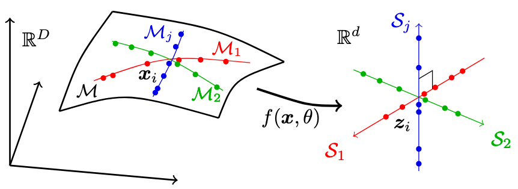

# Learning Diverse and Discriminative Representations via the Principle of Maximal Coding Rate Reduction
This repository is the official implementation of [Learning Diverse and Discriminative Representations via the Principle of Maximal Coding Rate Reduction](https://arxiv.org/abs/2006.08558) (2020) by [Yaodong Yu](https://yaodongyu.github.io/)* (UC Berkeley), [Kwan Ho Ryan Chan](ryanchankh.github.io)* (UC Berkeley), [Chong You](https://sites.google.com/view/cyou) (UC Berkeley), Chaobing Song (UC Berkeley) and Yi Ma (UC Berkeley).

## What is Maxmial Coding Rate Reduction? 
Our goal is to learn a mapping that maps the high-dimensional data that lies in a low-dimensional manifold to low-dimensional subspaces with the following three properties: 

<p align="center">
    <br>
</p>
<p align="center">

1. _Between-Class Discriminative_: Features of samples from different classes/clusters should be highly uncorrelatedand belong to different low-dimensional linear subspaces
2. _Within-Class Compressible_: Features of samples from the same class/cluster should be relatively correlated in a sense that they belong to a low-dimensional linear subspace
3. _Maximally Diverse Representation_: Dimension (or variance) of features for each class/cluster should beas large as possibleas long as they stay uncorrelated from the other classes

To achieve this, we propose an objective function called **Maximal Coding Rate Reduction** (MCR<sup>2</sup>). In our paper, we provide not only theoretical guarantees to the desired properties upon convergence, but also practical properties such as robustness to label corruption and empirical results such as state-of-the-art unsupervised clustering performance. For more details on algorithm design, please refer to our paper.


=======
This repository is the official implementation of the [NeurIPS'20 paper](https://arxiv.org/abs/2006.08558) "Learning Diverse and Discriminative Representations via the Principle of Maximal Coding Rate Reduction".

## Requirements
- This codebase is written for `python3`.
- To install necessary python packages, run `pip install -r requirements.txt`.


## Training
### Basics
- All functions used in training can be found in [`train_func.py`](./train_func.py), which includes: `load_checkpoint(...)`, `load_trainset(...)`, etc. For implementation details please refer to docstring. 
- Code for training are in the following files: [`train_sup.py`](./train_sup.py) and [`train_selfsup.py`](./train_selfsup.py). Each has its own command options. 
- Augmentations is used in unsupervised and contrastive setting. Check [`augmentloader.py`](./augmentloader.py) for implementation details. 

### Supervised Setting

```
usage: train_sup.py [-h] [--arch ARCH] [--fd FD] [--data DATA] [--epo EPO]
                    [--bs BS] [--lr LR] [--mom MOM] [--wd WD] [--gam1 GAM1]
                    [--gam2 GAM2] [--eps EPS] [--lcr LCR] [--lcs LCS]
                    [--tail TAIL] [--transform TRANSFORM]
                    [--save_dir SAVE_DIR] [--data_dir DATA_DIR]
                    [--pretrain_dir PRETRAIN_DIR]
                    [--pretrain_epo PRETRAIN_EPO]

optional arguments:
  -h, --help            show this help message and exit
  --arch ARCH           architecture for deep neural network (default: resnet18)
  --fd FD               dimension of feature dimension (default: 128)
  --data DATA           dataset for training (default: CIFAR10)
  --epo EPO             number of epochs for training (default: 500)
  --bs BS               input batch size for training (default: 1000)
  --lr LR               learning rate (default: 0.0001)
  --mom MOM             momentum (default: 0.9)
  --wd WD               weight decay (default: 5e-4)
  --gam1 GAM1           gamma1 for tuning empirical loss (default: 1.)
  --gam2 GAM2           gamma2 for tuning empirical loss (default: 1.)
  --eps EPS             eps squared (default: 0.5)
  --lcr LCR             label corruption ratio (default: 0)
  --lcs LCS             label corruption seed for index randomization (default: 10)
  --tail TAIL           extra information to add to folder name
  --transform TRANSFORM transform applied to trainset (default: default
  --save_dir SAVE_DIR   base directory for saving PyTorch model. (default: ./saved_models/)
  --data_dir DATA_DIR   base directory for saving PyTorch model. (default: ./data/)
  --pretrain_dir PRETRAIN_DIR load pretrained checkpoint for assigning labels
  --pretrain_epo PRETRAIN_EPO load pretrained epoch for assigning labels
```
Examples at a later section. 

### Self-supervised Setting

```
usage: train_selfsup.py [-h] [--arch ARCH] [--fd FD] [--data DATA] [--epo EPO]
                        [--bs BS] [--aug AUG] [--lr LR] [--mom MOM] [--wd WD]
                        [--gam1 GAM1] [--gam2 GAM2] [--eps EPS] [--tail TAIL]
                        [--transform TRANSFORM] [--sampler SAMPLER]
                        [--pretrain_dir PRETRAIN_DIR]
                        [--pretrain_epo PRETRAIN_EPO] [--save_dir SAVE_DIR]
                        [--data_dir DATA_DIR]

optional arguments:
  -h, --help            show this help message and exit
  --arch ARCH           architecture for deep neural network (default: resnet18)
  --fd FD               dimension of feature dimension (default: 32)
  --data DATA           dataset for training (default: CIFAR10)
  --epo EPO             number of epochs for training (default: 50)
  --bs BS               input batch size for training (default: 1000)
  --aug AUG             number of augmentations per mini-batch (default: 49)
  --lr LR               learning rate (default: 0.001)
  --mom MOM             momentum (default: 0.9)
  --wd WD               weight decay (default: 5e-4)
  --gam1 GAM1           gamma1 for tuning empirical loss (default: 1.0)
  --gam2 GAM2           gamma2 for tuning empirical loss (default: 10)
  --eps EPS             eps squared (default: 2)
  --tail TAIL           extra information to add to folder name
  --transform TRANSFORM transform applied to trainset (default: default
  --sampler SAMPLER     sampler used in augmentloader (default: random
  --pretrain_dir PRETRAIN_DIR load pretrained checkpoint for assigning labels
  --pretrain_epo PRETRAIN_EPO load pretrained epoch for assigning labels
  --save_dir SAVE_DIR   base directory for saving PyTorch model. (default: ./saved_models/)
  --data_dir DATA_DIR   base directory for saving PyTorch model. (default: ./data/)
```
Examples at a later section.


## Evaluation
Testing methods available are: `svm`, `knn`, `nearsub`, `kmeans`, `ensc`. Each method also has options for testing hyperparameters, such as `--k` for top `k` components in kNN. Methods can also be chained. Checkpoint can also be specified using `--epoch` option. Please refer to [`evaluate.py`](./evaluate.py) and [`cluster.py`](./cluster.py) and for more implementation details. 

- Command Options

```
usage: evaluate.py [-h] [--model_dir MODEL_DIR] [--svm] [--knn] [--nearsub]
                   [--kmeans] [--ensc] [--epoch EPOCH] [--k K] [--n N]
                   [--gam GAM] [--tau TAU] [--n_comp N_COMP] [--save]
                   [--data_dir DATA_DIR]

optional arguments:
  -h, --help            show this help message and exit
  --model_dir MODEL_DIR base directory for saving PyTorch model.
  --svm                 evaluate using SVM
  --knn                 evaluate using kNN measuring cosine similarity
  --nearsub             evaluate using Nearest Subspace
  --kmeans              evaluate using KMeans
  --ensc                evaluate using Elastic Net Subspace Clustering
  --epoch EPOCH         which epoch for evaluation
  --k K                 top k components for kNN
  --n N                 number of clusters for cluster (default: 10)
  --gam GAM             gamma paramter for subspace clustering (default: 100)
  --tau TAU             tau paramter for subspace clustering (default: 1.0)
  --n_comp N_COMP       number of components for PCA (default: 30)
  --save                save labels
  --data_dir DATA_DIR   path to dataset
```
- An example for evaluation:

```
$ python3 evaluate.py --knn --nearsub --k 10 --model_dir saved_models/sup_resnet18+128_cifar10_epo500_bs1000_lr0.001_mom0.9_wd0.0005_gam11.0_gam210.0_eps0.5_lcr0
```
, which runs kNN with top 10 components and nearest subspace on the latest checkpoint in `model_dir`.


## Others
- **(Extracting Features as .zip)** To extract the features, use `extract.py`.
- **(Plotting figures)** Plot functions are located in `plot.py`. Plots will be saved in `(model_dir)/figures/`
- **(Reproduce Results in Paper)**

#### Commands for Supervised Learning Setting

```
$ python3 train_sup.py --arch resnet18 --data cifar10 --fd 128 --epo 500 --bs 1000 --eps 0.5 --gam1 1 --gam2 1 --lr 0.01 --lcr 0.0
$ python3 train_sup.py --arch resnet18 --data cifar10 --fd 128 --epo 500 --bs 1000 --eps 0.5 --gam1 1 --gam2 1 --lr 0.01 --lcr 0.1
$ python3 train_sup.py --arch resnet18 --data cifar10 --fd 128 --epo 500 --bs 1000 --eps 0.5 --gam1 1 --gam2 1 --lr 0.01 --lcr 0.2
$ python3 train_sup.py --arch resnet18 --data cifar10 --fd 128 --epo 500 --bs 1000 --eps 0.5 --gam1 1 --gam2 1 --lr 0.01 --lcr 0.3
$ python3 train_sup.py --arch resnet18 --data cifar10 --fd 128 --epo 500 --bs 1000 --eps 0.5 --gam1 1 --gam2 1 --lr 0.01 --lcr 0.4
$ python3 train_sup.py --arch resnet18 --data cifar10 --fd 128 --epo 500 --bs 1000 --eps 0.5 --gam1 1 --gam2 1 --lr 0.01 --lcr 0.5
```

#### Commands for Self-supervised Learning Setting
```
$ python3 train_selfsup.py --arch resnet18ctrl --data cifar10 --fd 128 --epo 100 --bs 1000 --eps 0.5 --gam1 20 --gam2 0.05 --lr 0.1 --aug 50 --transform cifar
$ python3 train_selfsup.py --arch resnet18ctrl --data cifar100 --fd 128 --epo 100 --bs 1000 --eps 0.5 --gam1 20 --gam2 0.05 --lr 0.1 --aug 50 --transform cifar
$ python3 train_selfsup.py --arch resnet18stl --data stl10 --fd 128 --epo 100 --bs 1000 --eps 0.5 --gam1 20 --gam2 0.05 --lr 0.1 --aug 50 --transform stl10
```

## Reference
For technical details and full experimental results, please check [the paper](https://arxiv.org/abs/2006.08558). If you have used our work in your own, please consider citing: 

```
@article{yu2020learning,
  title={Learning diverse and discriminative representations via the principle of maximal coding rate reduction},
  author={Yu, Yaodong and Chan, Kwan Ho Ryan and You, Chong and Song, Chaobing and Ma, Yi},
  journal={Advances in Neural Information Processing Systems},
  volume={33},
  year={2020}
}

```

## License and Contributing
- This README is formatted based on [paperswithcode](https://github.com/paperswithcode/releasing-research-code).
- Feel free to post issues via Github. 

## Contact
Please contact [ryanchankh@berkeley.edu](ryanchankh@berkeley.edu) and [yyu@eecs.berkeley.edu](yyu@eecs.berkeley.edu) if you have any question on the codes.
